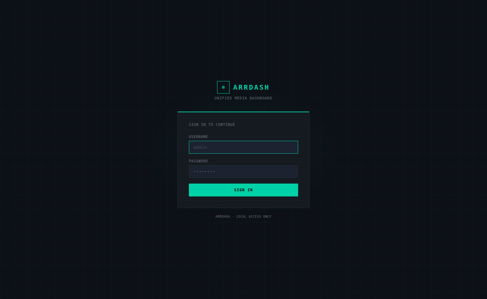
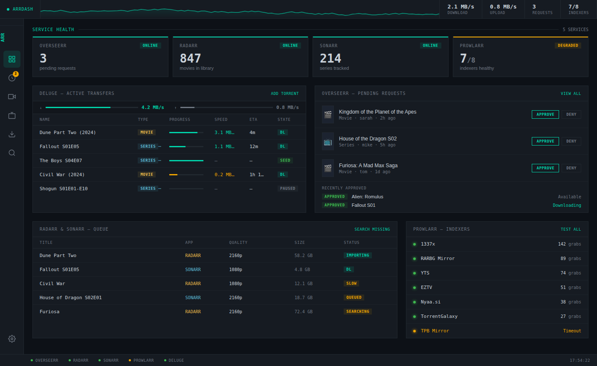
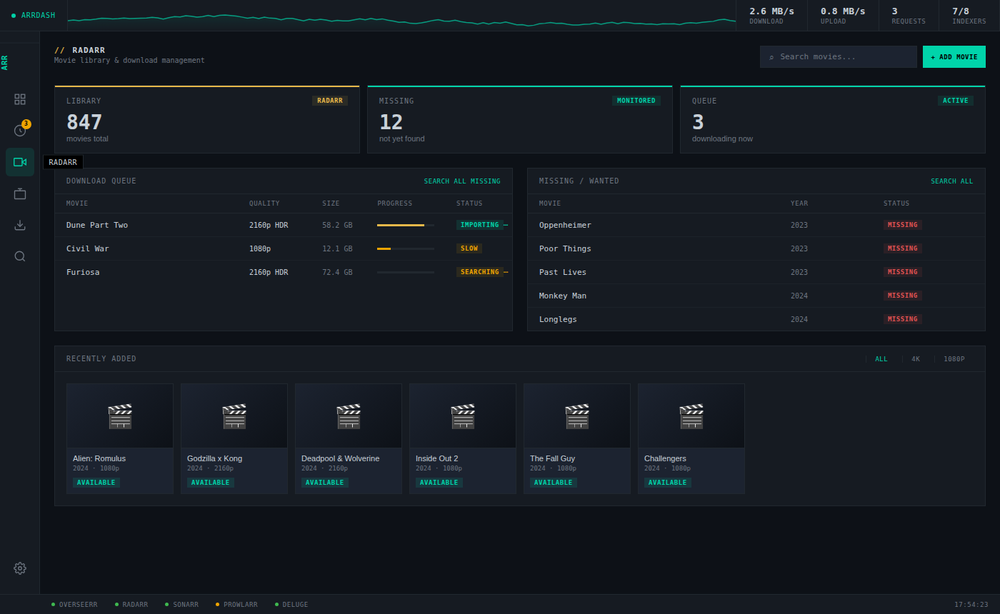
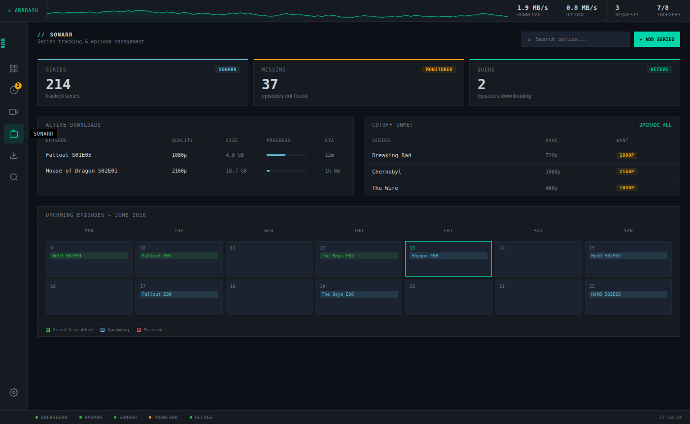
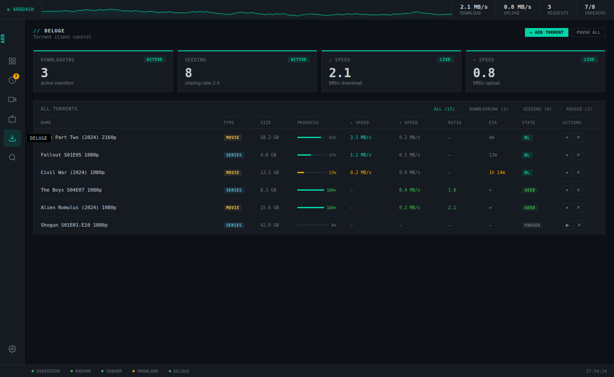
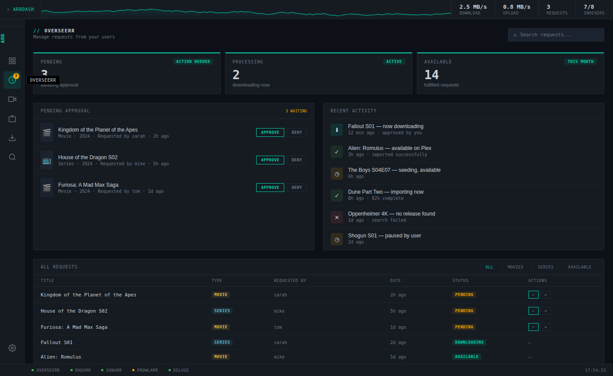
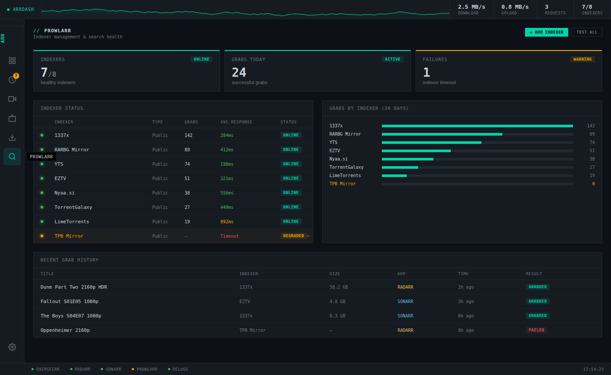
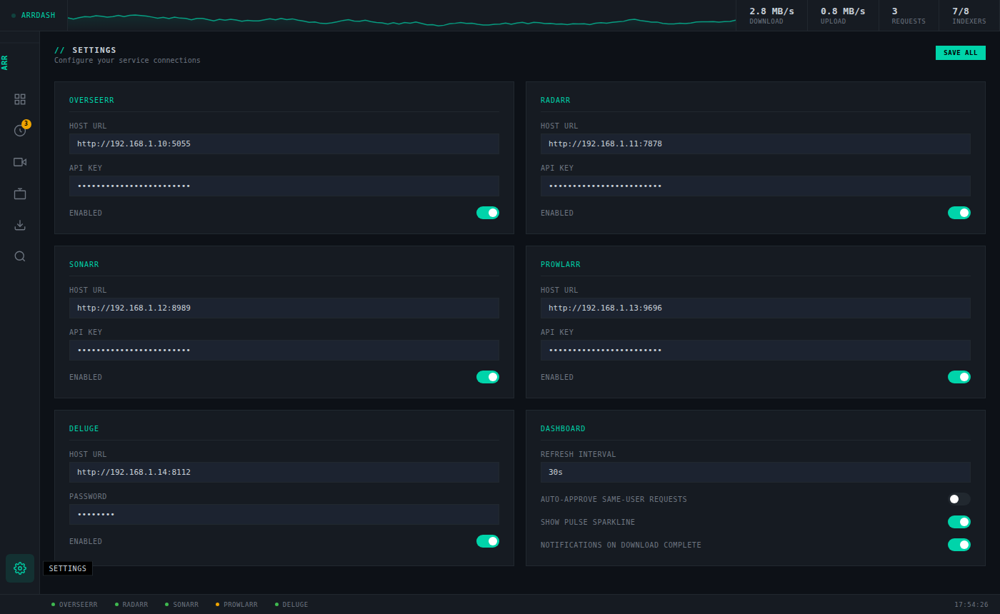

# ArrDash

A unified self-hosted dashboard for your Plex/arr stack.  
Overseerr · Radarr · Sonarr · Prowlarr · Deluge — all in one place.

---
## Screenshots









## Features

- Live status for all 5 services in a single view
- Approve/deny Overseerr requests inline
- Monitor and control Deluge transfers (pause, resume, remove)
- Browse Radarr & Sonarr queues, libraries, and missing media
- Search and add movies/series directly via Radarr & Sonarr APIs
- Prowlarr indexer health and grab history
- Sonarr episode calendar
- Auto-refreshes every 30 seconds

---

## LXC Setup (Proxmox)

### 1. Create the LXC

In Proxmox, create a new LXC container:
- **Template:** Debian 12 (Bookworm)
- **CPU:** 1–2 cores
- **RAM:** 256–512 MB
- **Disk:** 4 GB
- **Network:** Same bridge as your arr stack (e.g. `vmbr0`)

### 2. Install Node.js

```bash
# Update and install curl
apt update && apt install -y curl

# Install Node.js 20 LTS via NodeSource
curl -fsSL https://deb.nodesource.com/setup_20.x | bash -
apt install -y nodejs

# Verify
node -v   # should be v20.x.x
npm -v
```

### 3. Deploy ArrDash

```bash
# Copy the project to the LXC (run on your local machine)
scp -r arrdash/ root@<LXC_IP>:/opt/arrdash

# Or clone from git if you've pushed it
# git clone https://github.com/yourname/arrdash /opt/arrdash

# SSH into the LXC
ssh root@<LXC_IP>

# Install dependencies
cd /opt/arrdash
npm install --production
```

### 4. Configure

```bash
# Copy the example config
cp .env.example .env

# Edit with your actual IPs and API keys
nano .env
```

Your `.env` should look like:
```env
PORT=3000

OVERSEERR_URL=http://192.168.1.10:5055
OVERSEERR_API_KEY=your_key_here

RADARR_URL=http://192.168.1.11:7878
RADARR_API_KEY=your_key_here

SONARR_URL=http://192.168.1.12:8989
SONARR_API_KEY=your_key_here

PROWLARR_URL=http://192.168.1.13:9696
PROWLARR_API_KEY=your_key_here

DELUGE_URL=http://192.168.1.14:8112
DELUGE_PASSWORD=your_password
```

**Finding your API keys:**
- **Overseerr:** Settings → General → API Key
- **Radarr:** Settings → General → Security → API Key
- **Sonarr:** Settings → General → Security → API Key
- **Prowlarr:** Settings → General → Security → API Key
- **Deluge:** Password is the one you set in Deluge Web UI preferences

### 5. Run as a systemd service

```bash
# Create the service file
cat > /etc/systemd/system/arrdash.service << 'EOF'
[Unit]
Description=ArrDash
After=network.target

[Service]
Type=simple
User=root
WorkingDirectory=/opt/arrdash
ExecStart=/usr/bin/node server/index.js
Restart=on-failure
RestartSec=5
Environment=NODE_ENV=production

[Install]
WantedBy=multi-user.target
EOF

# Enable and start
systemctl daemon-reload
systemctl enable arrdash
systemctl start arrdash

# Check it's running
systemctl status arrdash
```

### 6. Access

Open your browser and go to:
```
http://<LXC_IP>:3000
```

---

## Optional: Nginx Reverse Proxy

If you want to access ArrDash at a cleaner URL or port 80, install Nginx in the same LXC:

```bash
apt install -y nginx

cat > /etc/nginx/sites-available/arrdash << 'EOF'
server {
    listen 80;
    server_name arrdash.local;  # or your LXC IP

    location / {
        proxy_pass http://localhost:3000;
        proxy_http_version 1.1;
        proxy_set_header Upgrade $http_upgrade;
        proxy_set_header Connection 'upgrade';
        proxy_set_header Host $host;
        proxy_cache_bypass $http_upgrade;
    }
}
EOF

ln -s /etc/nginx/sites-available/arrdash /etc/nginx/sites-enabled/
nginx -t && systemctl reload nginx
```

---

## Development

```bash
npm install         # installs devDependencies including nodemon
npm run dev         # runs with auto-restart on file changes
```

---

## Project Structure

```
arrdash/
├── server/
│   ├── index.js          # Express entry point
│   ├── config.js         # Loads .env config
│   └── routes/
│       ├── overseerr.js  # Overseerr API proxy
│       ├── radarr.js     # Radarr API proxy
│       ├── sonarr.js     # Sonarr API proxy
│       ├── deluge.js     # Deluge JSON-RPC proxy
│       └── prowlarr.js   # Prowlarr API proxy
├── public/
│   ├── index.html        # Frontend UI
│   └── app.js            # Frontend data + interactions
├── .env                  # Your config (never commit this)
├── .env.example          # Template
└── package.json
```
